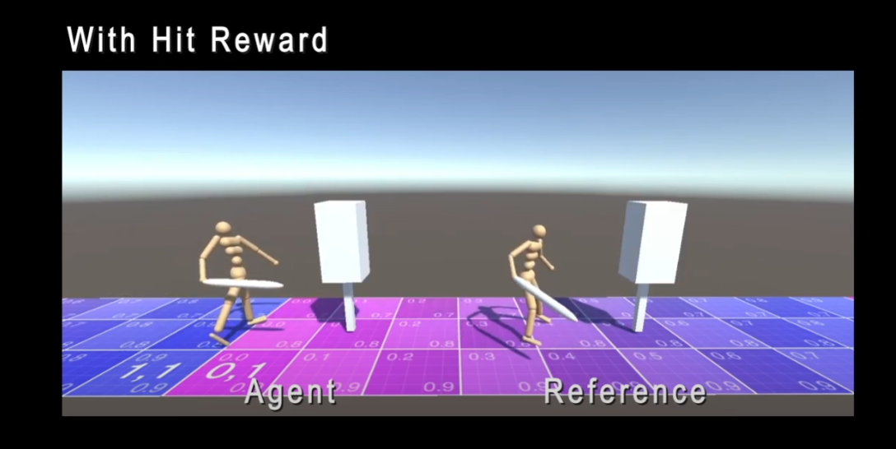

# Marathon Environments

This repository is forked from [GitHub - Unity-Technologies/marathon-envs: A set of high-dimensional continuous control environments for use with Unity ML-Agents Toolkit.](https://github.com/Unity-Technologies/marathon-envs)

I implemented one kind of **Reinforcement Learning Physics-Based Character Interaction** with this development environment: **hit and bounce.**

Please check this video:

[Reinforcement Learning of Physics Based Character Interaction - YouTube](https://www.youtube.com/watch?v=4xiNyxKHw5o)

